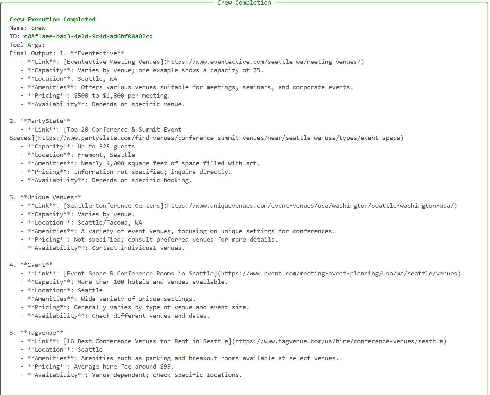

# CrewAI based AI agents crew for finding conference venue
This project is a CrewAI based AI agents Crew for finding conference venue for a requested city
based on criteria such as avaliability, space, cost etc

## Installation
1.  Clone the repository: `git clone [repository URL]`
2.  Install dependencies: `pip install crewai, crewai_tools dotenv`
3.  Add .env file with key OPEN_AI_API_KEY, containing your OpenAI api key. [OpenAI site](https://platform.openai.com/settings/organization/api-keys)
4. Add .env file with key SERPER_API_KEY, containing your Serper api key. [Serper site](https://serper.dev/api-keys)
5.  Run the project: `python main.py`

## Usage
This project is a CrewAI based AI agents Crew for finding conference venue for a requested city
based on criteria:
a) capacity
b) location
c) amenities
d) pricing

## Model Scorecard
### Input data
Seattle,WA

### Model used
OpenAI gpt-4o-mini

### Sample output 
Output of conference finding CrewAI based AI crew when searching for Seattle,WA

