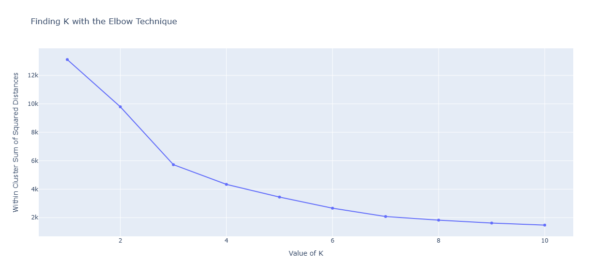

# Customer Segmentation with k-means Clustering
This project do customer segmentation with k-means clustering

## Installation
1.  Clone the repository: `git clone [repository URL]`
2.  Install dependencies: `pip install scikit-learn pandas plotly numpy`
3.  Run the project: `python main.py`

## Usage
This project group customers based on similarities and differences using an unsupervised clustering model. So that businesses can tailor their marketing efforts, refine product offerings, and enhance the overall customer experience.

This is solving project mentioned on Educative.io site [link](https://www.educative.io/projects/customer-segmentation-with-k-means-clustering)

## Model Scorecard
### Input data
Online Retail dataset provided by the UCI ML repository. This dataset includes the online purchase history of a UK-based store for its wholesale customers from 2010–2011.

### Model used
K-Mean clustering algorithm

### Evaluation 

.png>)
