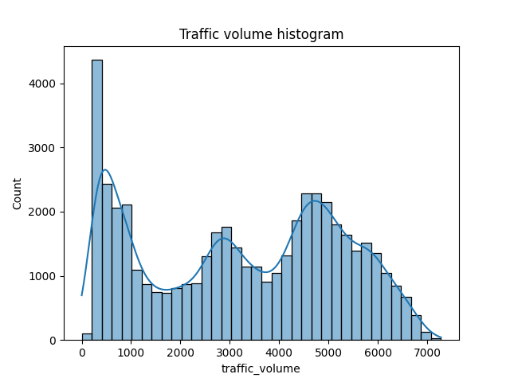

# Traffic prediction using machine learning
This project predicts traffic volume on a roadway using different machine learning techniques.

## Installation
1.  Clone the repository: `git clone [repository URL]`
2.  Install dependencies: `pip install scikit-learn pandas matplotlib seaborn joblib`
3.  Run the project: `python TrafficPred.py`
## Usage
This project predicts traffic volume on a roadway using different machine learning techniques using scikit-learnand compares their results. Finally, saving all models, using for future deployment, allowing us to make real-time traffic volume predictions.

This is solving project mentioned on Educative.io site [link](https://www.educative.io/projects/how-to-predict-traffic-volume-using-machine-learning)

## Model Scorecard
### Input data


Historical data, including date and time, weather conditions, and holidays, to predict the traffic volume on the roads.

### Different models used
linear regression, decision tree regressor, and random forest regressor.

### Evaluation 

```
                   r2_score           MSE
Linear Regression  -4.008000        1.997650e+07
Decision Tree      0.929157         2.825883e+05
Random Forest      0.958792         1.643752e+05
```